# widget_list

`widget_list` renders sortable, searchable Rails data grids with Ajax paging and CSV export. Version 2.0.0 has been exercised with **Rails 8.1.4**, **Ruby 3.4.11**, **Sequel 5.109.0**, **Ransack 5.0.2**, and SQLite. The restored administration console is in the 2.0.1 source on `main`; publish 2.0.1 before installing it from RubyGems. Rails 8.1 requires Ruby 3.2 or newer. The Rails 3 era guide remains in [docs/legacy-readme.md](docs/legacy-readme.md) for reference.

The runnable [widget_list_example_rails8](https://github.com/davidrenne/widget_list_example_rails8/) contains both a Sequel SQL list and a Ransack/Active Record list. Its README and single commit diff show every caller change needed in a fresh Rails 8 app.

## Video demo

[](https://www.youtube.com/watch?v=A6mZa8Ge2Rk)

This video shows the original 1.x interface. For the Rails 8 integration, use the current example app below.

## Add it to a Rails 8 app

`widget_list` uses jQuery and Sprockets assets. In your Gemfile:

```ruby
gem 'sprockets-rails'
gem 'jquery-rails'
gem 'widget_list', '~> 2.0'
```

Run `bundle install`. Add `app/assets/config/manifest.js`:

```javascript
//= link_tree ../images
//= link_directory ../stylesheets .css
//= link_directory ../javascripts .js
//= link widget_list.css
//= link widgets.css
//= link widget_list.js
```

Add `app/assets/javascripts/application.js`:

```javascript
//= require jquery
//= require jquery_ujs
//= require widget_list
```

Load the assets in the application layout's `<head>`:

```erb
<%= csrf_meta_tags %>
<%= stylesheet_link_tag 'application', 'widget_list', 'widgets' %>
<%= javascript_include_tag 'application' %>
```

Load this script in the layout's `<head>` without `defer`: the administration wizard's inline script needs jQuery as it is parsed. The gem resolves its image URLs through Sprockets when compiling CSS. No manual image copy or static middleware is needed. An app using the default Rails 8 Propshaft pipeline should replace `propshaft` with `sprockets-rails` for this integration. Run `bin/rails assets:precompile` to check production assets.

## Choose a database source

**Active Record only:** `config/widget-list.yml` is optional. The gem uses the current Rails environment's Active Record connection as its primary source. Pass an `ActiveRecord::Relation` as `list['view']`.

**Sequel SQL and Active Record together:** create `config/widget-list.yml` with the Sequel URI as `primary` and the Rails database environment name as `secondary`:

```yaml
development:
  :primary: sqlite://<%= Rails.root.join('storage/development.sqlite3') %>
  :secondary: development
  :api_mode: false
test:
  :primary: sqlite://<%= Rails.root.join('storage/test.sqlite3') %>
  :secondary: test
  :api_mode: false
```

Set `list['database']` to `'primary'` for a SQL table or view name, or `'secondary'` for an Active Record relation. Use the corresponding database file from your app's `config/database.yml`. Only SQLite was exercised during this upgrade; the older examples for PostgreSQL, Oracle, and MongoDB have not been reverified.

## Render a list

The controller must answer GET for the first page and POST for the gem's Ajax controls. For example:

```ruby
# config/routes.rb
match '/items', to: 'items#index', via: [:get, :post]

# app/controllers/items_controller.rb
class ItemsController < ApplicationController
  def index
    list = WidgetList::List.init_config
    list['name'] = 'items'
    list['database'] = 'primary' # omit for the default Active Record source
    list['view'] = 'items'       # use Item.all for Active Record
    list['fields'] = { 'id' => 'ID', 'name' => 'Name', 'sku' => 'SKU' }
    list['searchIdCol'] = ['id', 'sku']
    list['rowLimit'] = 10

    type, output = WidgetList::List.build_list(list)
    case type
    when 'html'   then @output = output
    when 'json'   then render json: JSON.parse(output)
    when 'export' then send_data output, filename: 'items.csv', type: 'text/csv'
    end
  end
end
```

In `app/views/items/index.html.erb`, render `<%= raw @output %>`. Only use trusted values in custom HTML fields and SQL fragments. The gem builds markup and SQL from list configuration.

For Ransack filtering, allowlist searchable model columns and pass both the search object and its relation:

```ruby
class Item < ApplicationRecord
  def self.ransackable_attributes(_auth_object = nil)
    %w[id name sku]
  end
end

search = Item.ransack(params[:q])
list['database'] = 'secondary' # omit if Active Record is primary
list['ransackSearch'] = search
list['view'] = search.result
```

A standard GET URL such as `/items?q[name_cont]=Apple` applies the filter. The gem also renders its advanced Ransack form from `ransackSearch`.

## Try the example

The example installs the published 2.0.0 gem from RubyGems. Clone and run it anywhere:

```sh
git clone https://github.com/davidrenne/widget_list_example_rails8.git
cd widget_list_example_rails8
bundle install
bin/rails db:prepare
bin/rails db:seed
bin/rails test
bin/rails server
```

Open `http://127.0.0.1:3000/` for Sequel or `/ransack` for Active Record. Search SKU `1001`, change pages, export CSV, or open the filter arrow and set **Name contains Apple**.

## Administration console

The original administration wizard is restored in the [Rails 8 migration example](https://github.com/davidrenne/widget_list_example). Open `/administration` there to choose an Active Record model and fields, configure sorting, search, row buttons and export, preview the list, then generate starter controller code. Hidden fields, field functions, grouping fields, and the drill-down value column use dropdowns populated from the selected model's table columns. The drill-down display column remains editable for custom expressions. The example routes the wizard only in development and test. It uses the sibling `widget_list` checkout, so the console fixes require the 2.0.1 source until that version is published.

To add the wizard to your own app, first complete the asset setup above. Then add a GET/POST route, a controller action, and a view:

```ruby
# config/routes.rb
if Rails.env.development? || Rails.env.test?
  match '/administration', to: 'widget_list_examples#administration',
        via: [:get, :post], as: :administration
end

# app/controllers/widget_list_examples_controller.rb
class WidgetListExamplesController < ApplicationController
  def administration
    @output = WidgetList.go!
    render json: JSON.parse(@output) if params.key?(:ajax)
  end
end
```

```erb
<%# app/views/widget_list_examples/administration.html.erb %>
<div style="margin: 50px"><%= raw @output %></div>

<%# Link from a page in development %>
<%= link_to 'Administration Console', administration_path if Rails.env.development? %>
```

If `config/widget-list.yml` points `primary` at Sequel and `secondary` at Active Record, leave **Primary Connection?** unchecked when selecting a model. The wizard now defaults to that choice. Ransack requires the model's `ransackable_attributes` allowlist shown above. The generated action needs a GET/POST route and a view that renders `@output`, just like a hand-written list. Review the generated fields, links and controller code before using it. The wizard writes draft configuration to `config/widget-list-administration.json` and saved configurations to `config/widget-list-administration-all.json`; the example ignores both files in Git. Keep the route accessible only to trusted developers: the preview evaluates generated Ruby and the wizard writes files.

These are the original screenshots from the Rails 3 era. The Rails 8 wizard uses the same steps, while its generated code and preview have been updated for Rails 8 and Ransack 5.

| Start with a model | Configure search and export |
| --- | --- |
| 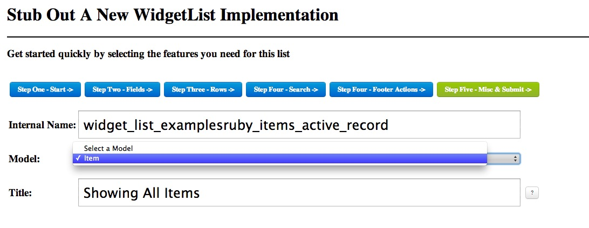 | 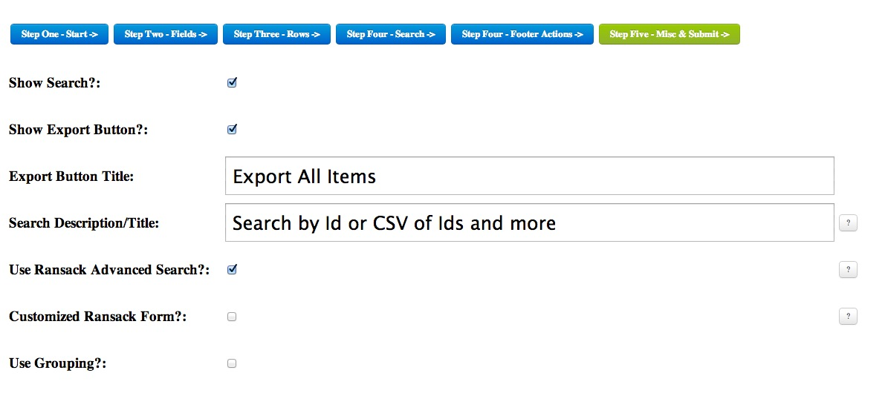 |

| Select fields | Configure row buttons |
| --- | --- |
| 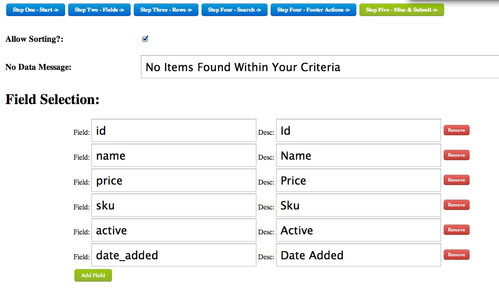 | 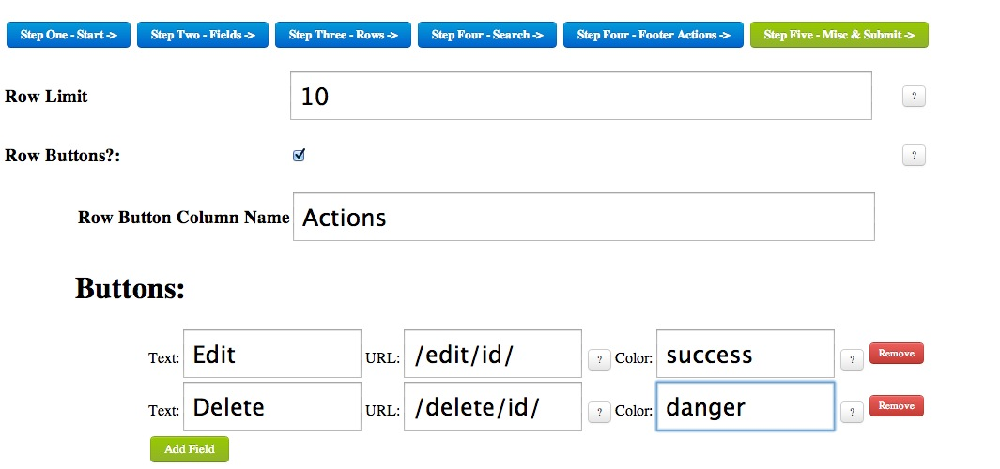 |

| Preview the list | Generate controller code |
| --- | --- |
| 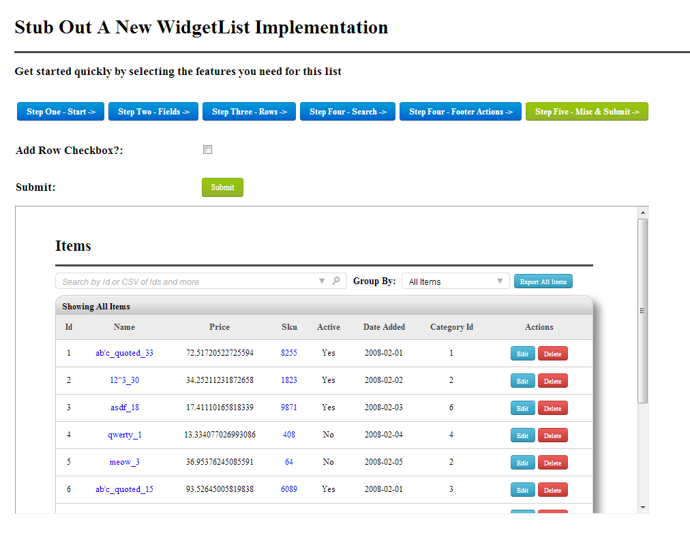 | 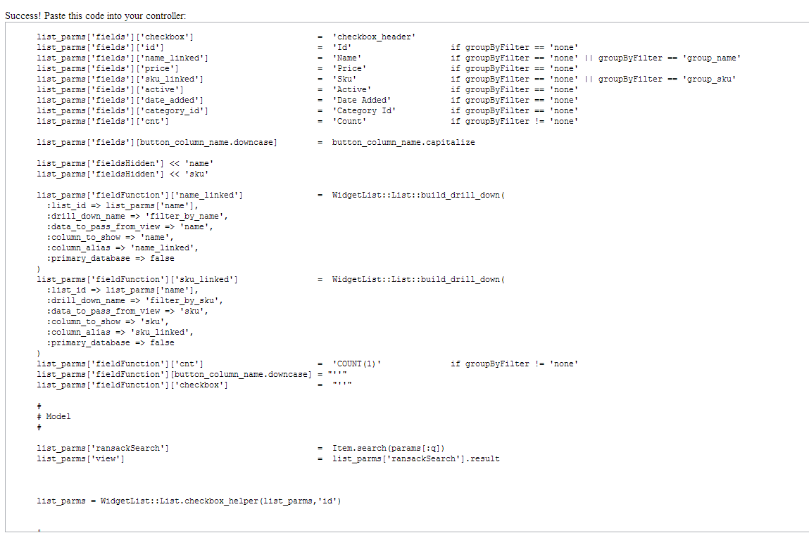 |

<details>
<summary>More original widget_list screenshots</summary>

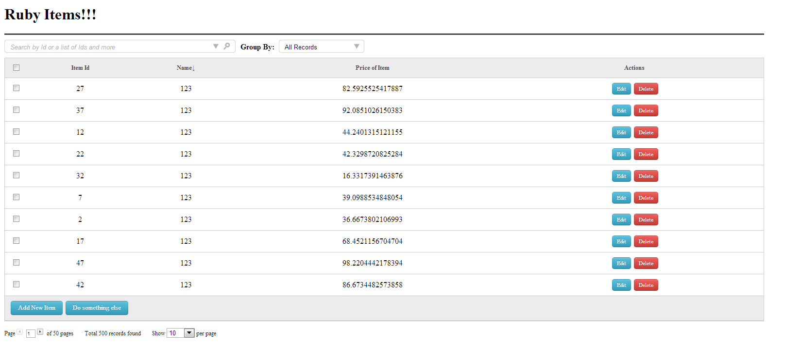
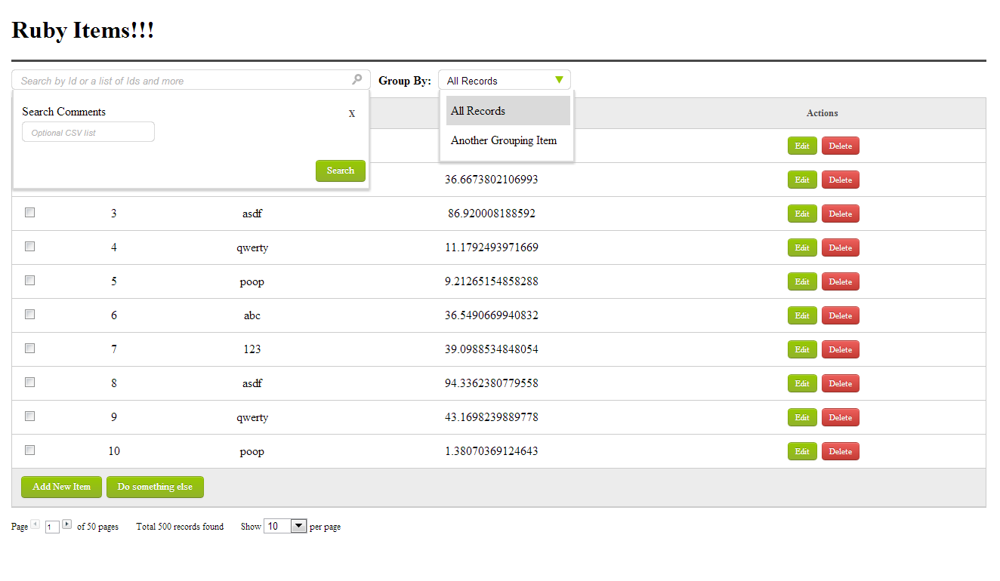
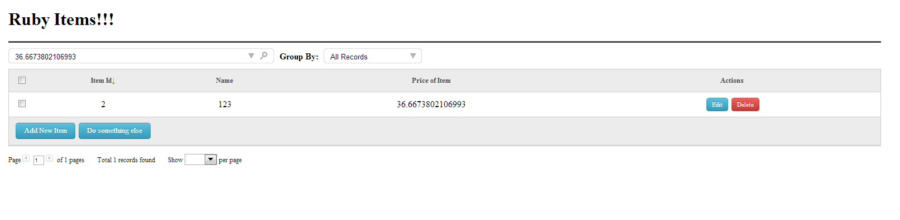
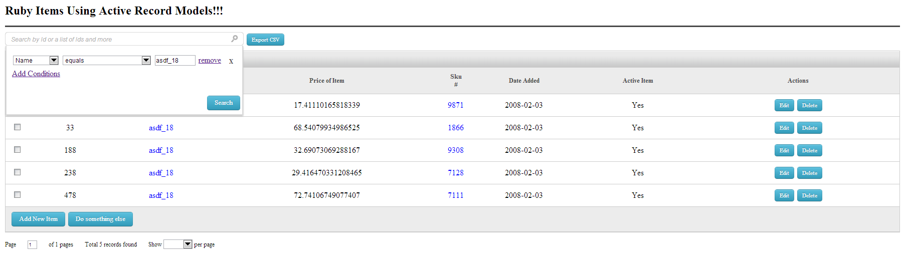
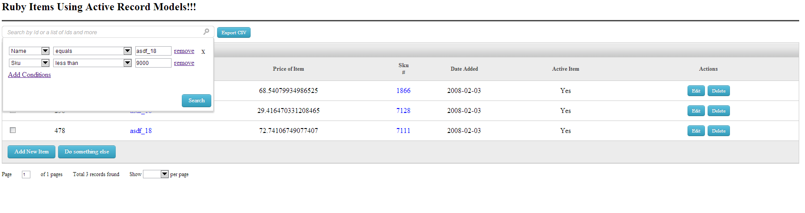
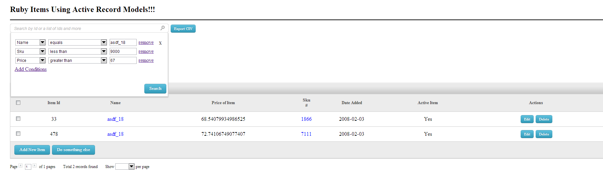
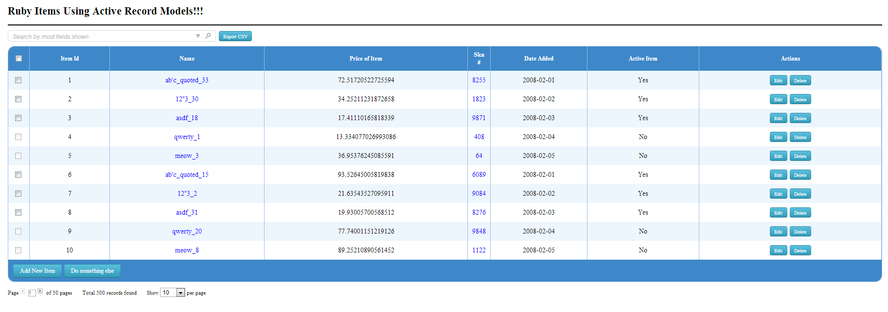

</details>

## Release

Version 2.0.0 is published; the administration console fixes are prepared as 2.0.1 on `main` and have not been published. The RubyGems page takes its short summary and longer description from `gem.summary` and `gem.description` in [widget_list.gemspec](widget_list.gemspec). To change them in a future release, bump `WidgetList::VERSION` in `lib/widget_list/version.rb` and publish a new version; published versions cannot be overwritten.

`./checkin_gem.sh` validates and builds the gem, and runs the sibling local-source Rails 8 example tests when present. Review and commit your changes on `main`. Sign in to the command-line publisher with `gem signin` if needed, using an API key with the `push_rubygem` scope. A RubyGems website session does not sign in the `gem` command. Then run `./publish_gem.sh`; it checks that the tree is clean, builds the package, and pushes it to RubyGems.org. RubyGems may prompt for MFA in the terminal or open a browser for WebAuthn. No credential is stored in these scripts. Publishing is a separate, intentional step from committing.

See [RubyGems publishing](https://guides.rubygems.org/publishing/) and [MFA setup](https://guides.rubygems.org/setting-up-otp-mfa/) for account setup.

## Upgrade notes

The migration replaced Rails 3 callbacks and asset middleware, Ruby's removed `URI.decode`, unsafe SQL `eval`, and process-wide request globals. Ransack 5 requires explicit `ransackable_attributes` in each searchable model. The Rails 8 examples verify the list, Ajax search, pagination, advanced Ransack filtering, CSV export, and asset compilation. The migration example also exercises the administration wizard, its preview, and generated code. Non-SQLite adapters remain unverified.
